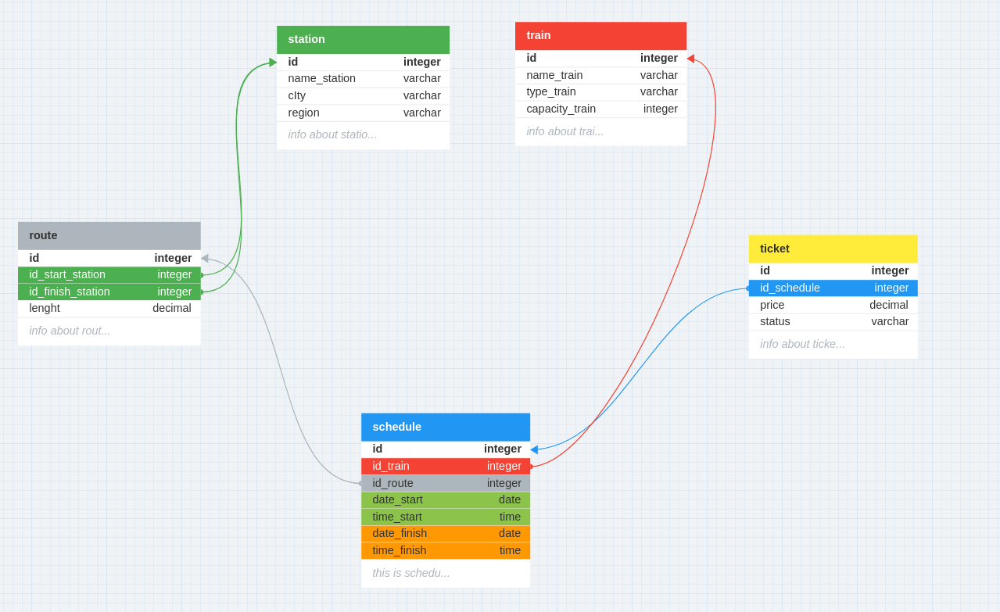

# RGD_DB

Примерный проект базы данных для продажи железнодорожных билетов на территории России.

## 1. Основная модель 

### 1.1 Индексы
1.  Индекс на столбец "id_start_station" в таблице "route":
    Этот индекс поможет ускорить операции, связанные с поиском маршрутов, которые начинаются с определенной станции.

2.  Индекс на столбец "id_finish_station" в таблице "route":
    Этот индекс ускорит операции поиска маршрутов, которые заканчиваются на определенной станции.

3.  Индекс на столбец "id_train" в таблице "schedule":
    Этот индекс ускорит операции поиска расписания для определенного поезда.

4.  Индекс на столбец "id_route" в таблице "schedule":
    Этот индекс улучшит производительность операций поиска расписания для определенного маршрута.

5.  Индекс на столбец "id_schedule" в таблице "ticket":
    Этот индекс поможет ускорить операции поиска билетов по расписанию.

## 2. Модель аутентификации
